# Project4

- **Name :** Zhuoyun Qian
- **Email :** 3290862073@qq.com
- **Due :** 5/3/2024

**Link to assignment :**[csci-591-fall2023-private/project4 at main · QXinHan/csci-591-fall2023-private (github.com)](https://github.com/QXinHan/csci-591-fall2023-private/tree/main/project4)


## Task1: Parent Process

**Target:** Launch the Process Explorer as Administrator. Find the name of the parent process, covered by a green box in the image below.  

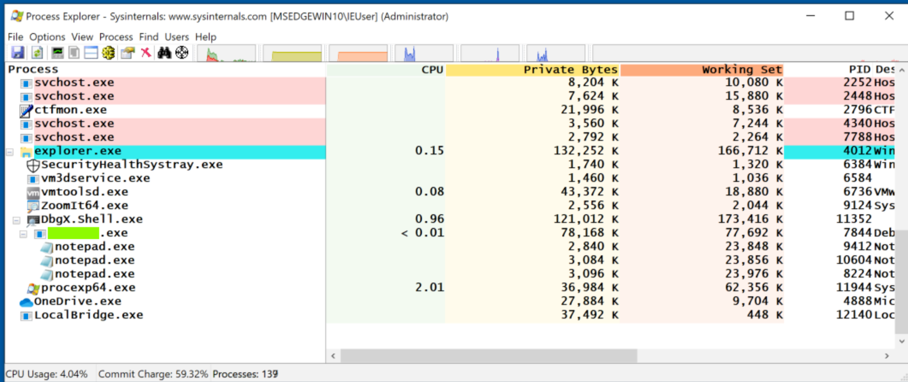

**Solution:**

_Launch the WinDbg.exe as Administrator. In WinDbg.exe click **File**, `Launch executable`._

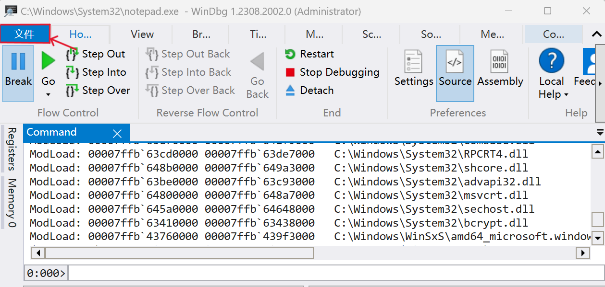

_Navigate to `C:\Windows\System32\notepad.exe`, and open it._

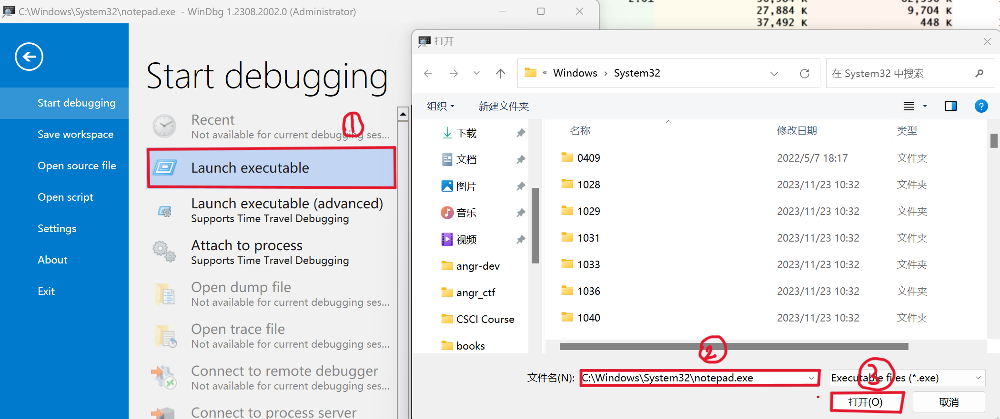

_Launch the Process Explorer, scroll down to find flag._

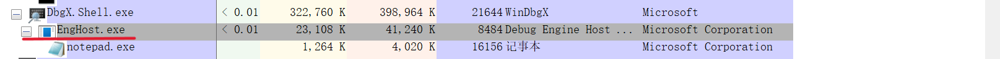

**Finally, the flag is `EngHost`.**

## Task2: Crash Message

**Target:** Find the flag covered by a green box in the image below. 

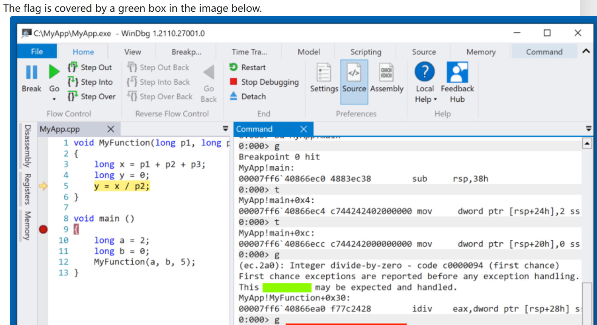

**Solution:**

_Use `x64 Native Tools Command Prompt ` to create a C++ program._

_In the `x64 Native Tools Command Prompt` window, execute these commands:_

```
mkdir c:\MyApp
cd c:\MyApp
notepad MyApp.cpp
```

_Click **Yes** to create a new file._

_Paste in this code, as shown below._

```c++
void MyFunction(long p1, long p2, long p3)
{
    long x = p1 + p2 + p3;
    long y = 0;
    y = x / p2;
}
void main ()
{
    long a = 2;
    long b = 0;
    MyFunction(a, b, 5);
}
In Notepad, save the file.
```

_Then execute `cl/Zi MyApp.cpp` . We get some files._

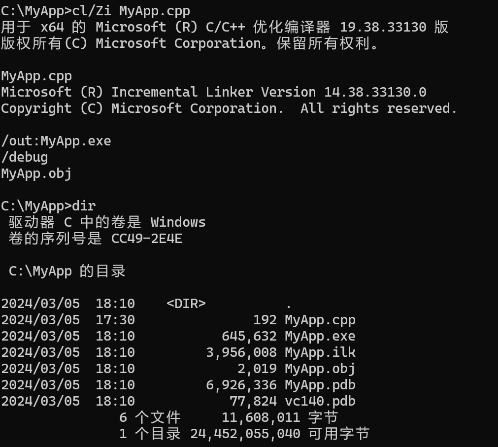

_Launch the WInDbg.exe, load in the MyApp.exe, directly execute the command `g` in the command line._

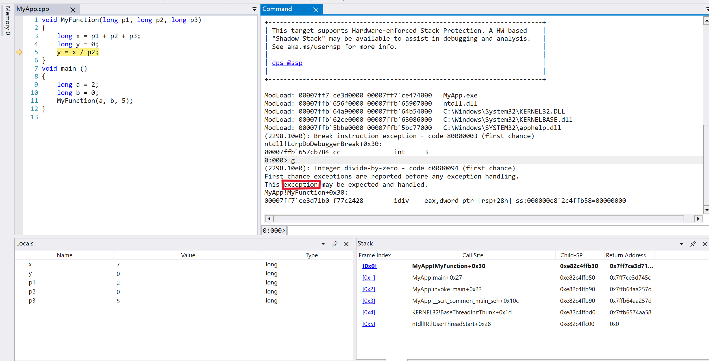

**Finally, we can find the flag is `exception`.**

## Task3:  WarBird

**Target:** Find the function shown in the image below. The flag is covered by a green box in the image below.

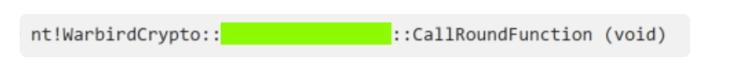

**Solution:**

_In the image, I find the "nt" which is a short name for "ntoskrnl.exe". so I need to find the function by kernel debugging._

_Firstly, launch the "cmd" as a Administrator, and execute these commands (to enable local machine kernel-mode debugging):_

```
bcdedit /debug on
bcdedit /dbgsettings local
```

_Restart the machine._

_Run the WinDbg Preview as Administrator. In WinDbg click the File, "Attached to kernel"._

_In the right plane click the **Local**, then click **OK**._

   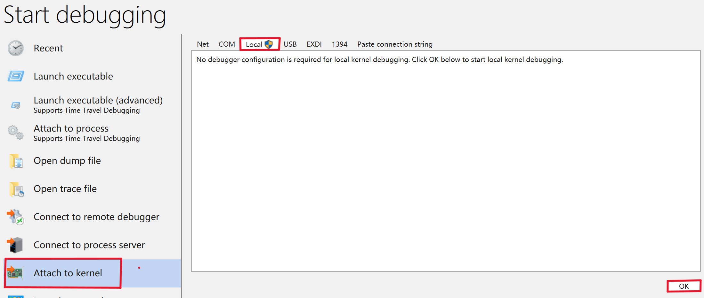

_Execute the command `x /D /f nt!WarBird*`_

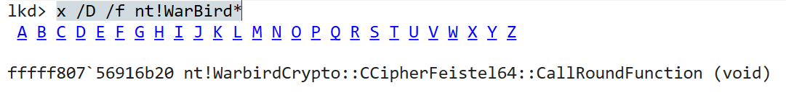

**Finally, we get the flag `CCipherFeistel64`.**

**Remember  to disable the kernel debug.**

```
bcdedit /debug off
```

**Then restart computer.**

## Task4: Magic

**Target:** find the flag covered in the green box.

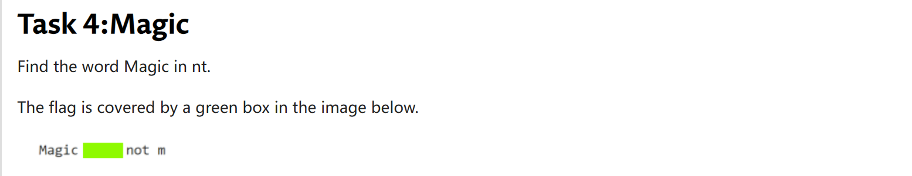

**Solution:**

_The word "Magic" is in the memory of nt. So I can use the command `s` to search memory for the string "Magic"._

_command:_

```
s -a imageBase imageSize "target word"
```

_firstly, execute the commend `lm`._

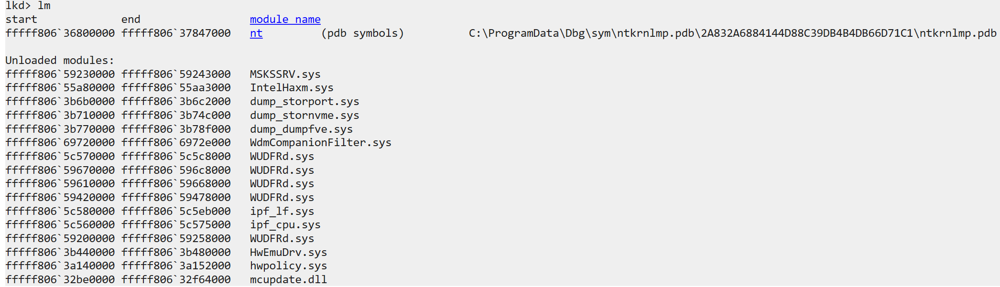

_Then click the `nt` to get the imagebase and size of nt.exe._

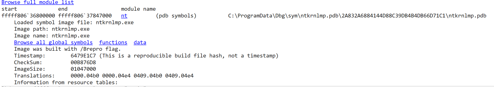

_We can see the start address of nt and size of nt, so we execute the commend `s -a fffff80636800000 L?01047000 "Magic" `to search "Magic" in memory._

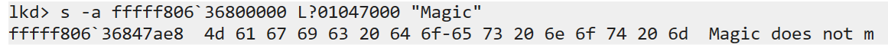

**We can find the flag is `does`.**

## Task5: Module

**Target:** find the flag covered in the green box.

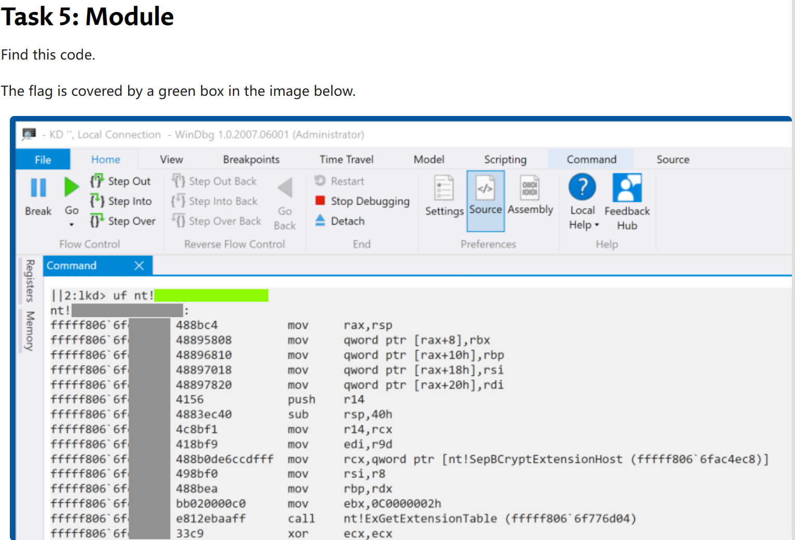

**Solution1:**

_To find the function which calls `SepBCryptExtensionHost`. And then dissemble them for comparison._

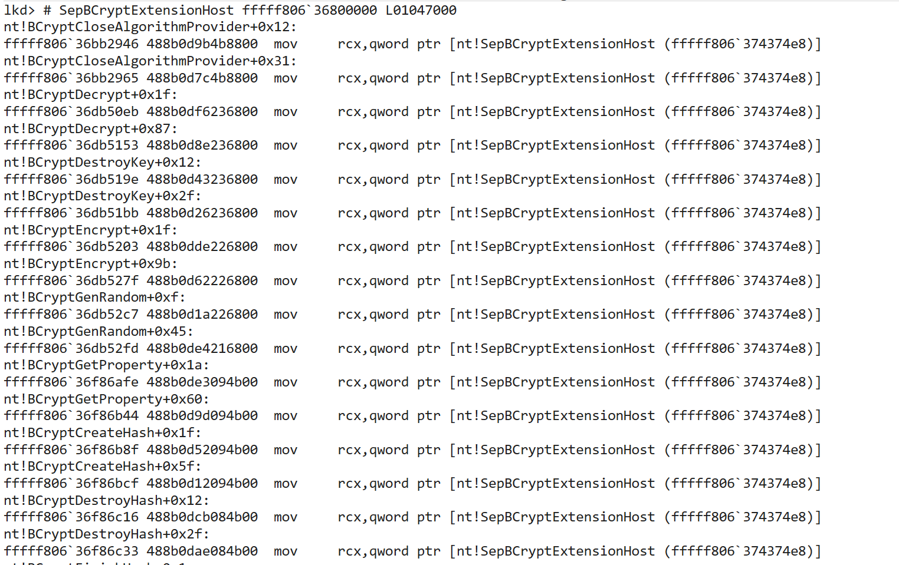

_You can find that it is almost impossible to search through this way. Because there so many invocations!_

_So we prefer to solution2._

**Solution2:**

_Directly search the hard code in memory. Use the commend as follows:_

```
s -b imagebase Lsize hard code
```

_After finding the imagebase and size of nt, then execute the following commend!_

_The way to get the imagebse and size of nt I have mentioned in task4._

```
s -b fffff806`36800000 L01047000 48 8b c4 48 89 58 08 48 89 68 10 48 89 70 18 48 89 78 20 41 56 48 83 ec 40 4c 8b f1 41 8b f9
```

_After executing the commend, It searched three addresses._

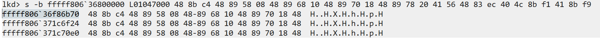

_Then I use commend `u + address` to get the functions by their addresses._

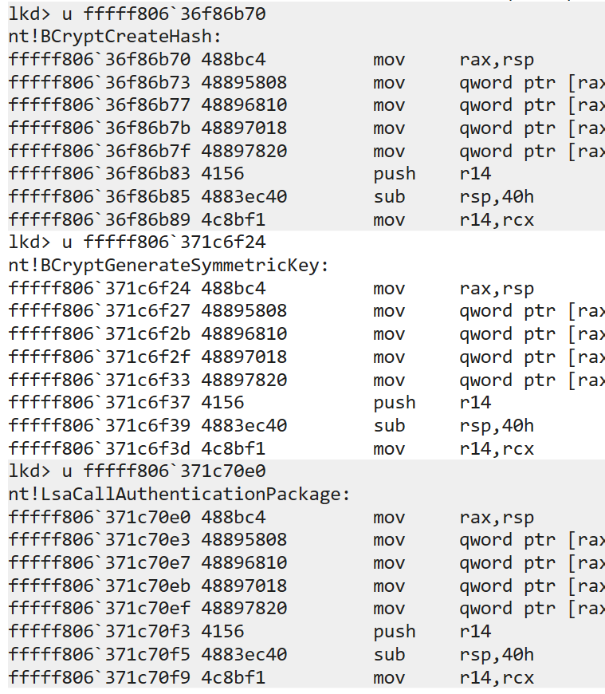

_Execute the commend `uf + functionname ` to get the disassembly instructions. Then compare with the target function._

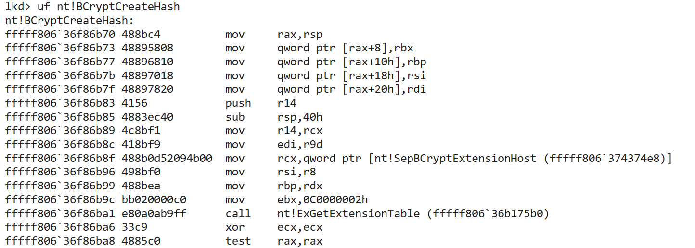

**Finally We find the flag is `BCryptCreateHash`.**
